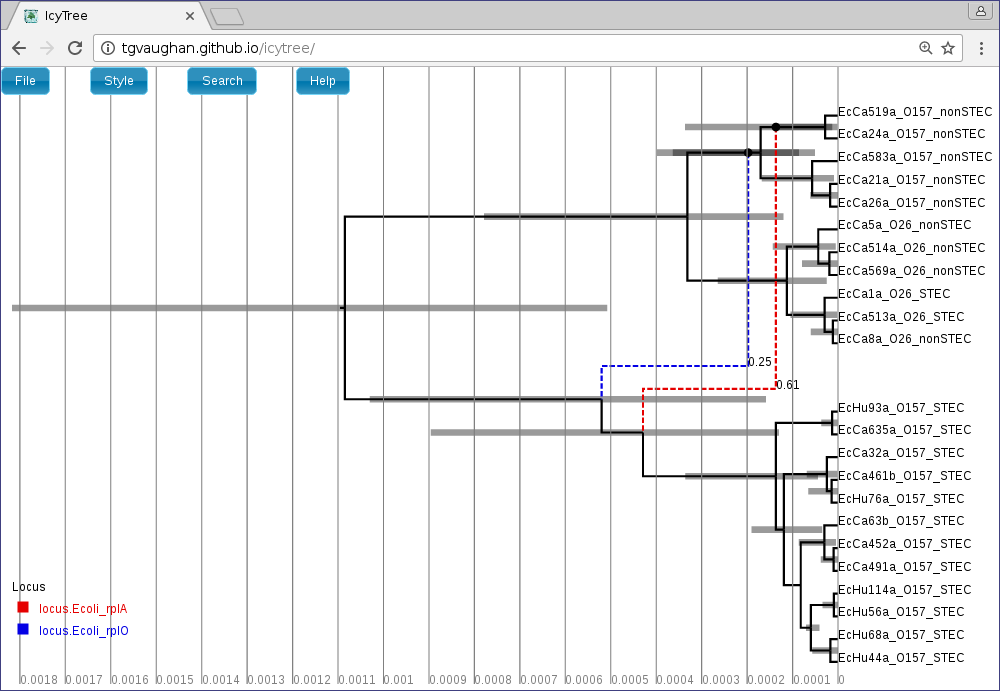

Background
==========

[Bacter](http://tgvaughan.github.io/bacter) is a [BEAST
2](http://www.beast2.org/) package dedicated to performing inference of
bacterial sequence data. In general, it allows for joint inference of
the Ancestral Recombination Graph (ARG), recombination rates, tract
lengths, substitution rate and population dynamics. Exactly what may be
inferred from a given data set depends heavily on the size of the data
set, and the rates of recombination and mutation for the population
under study, and the sampling procedure.

This tutorial will gently walk you through the process of using Bacter to the
ARG and associated parameters using an example multi-locus data set.

Installation
============

Software requirements
---------------------

In order to use Bacter and visualize its analysis results the following
software must be installed:

-   BEAST 2 version 2.4 or later. <http://www.beast2.org/>
-   Tracer version 1.6 or later.  <https://github.com/beast-dev/tracer/releases/latest>
-   A recent version of [Mozilla Firefox](http://www.mozilla.org/firefox)
    or [Google Chrome](http://www.google.com/chrome).

Bacter Package Installation
---------------------------

Bacter is easily installed via the BEAUti package manager. To do this,
run BEAUti and select "Manage Packages" from the File menu:

{width=80%}

Then, ensure the "bacter" package is highlighted before pressing the
"Install/Upgrade" button:

{width=80%}

That's it! Bacter is now installed. It is a good idea to restart BEAUti
at this point.

Setting up the analysis
=======================

Choosing the Bacter BEAUti template
-----------------------------------

Open the BEAUti program. Before doing anything else we must switch to
the Bacter template. To do this, open the file menu and from the
Template submenu select "Bacter".

{width=80%}

Loading sequence alignments
---------------------------

In this tutorial we will be analyzing a subset of the E. coli data presented in
[Vaughan et al., Genetics, 2017](http://dx.doi.org/10.1534/genetics.116.193425).  The full data set
consists of 53 individual gene alignments, each containing 23 sequences. In
order to keep our tutorial analysis as manageable as possible, we will analyze
only 12 of these genes.

To load the alignments, select File-&gt;Import Alignment and navigate
to the directory containing the tutorial data.  This directory contains
12 FASTA files, each containing the alignment for the named gene. Since
the directory contains only these files and nothing else, we can select
them all simply using Ctrl+A (or Command+A on a Mac).

{width=80%}

After pressing Open, the alignments should be visible as 12 new records
in the table. By default, each locus is assumed to have its own distinct
site, clock and "tree" (really ARG here) models. Since our ARGs
potentially span multiple loci, we should definitely cause the loci to
share a tree model. This is done by selecting both rows in the table by
again holding down Ctrl (or Command) and clicking each in turn.
Alternatively, you can just click on one row and then press Ctrl+A, or Command+A on a Mac.
(This is easier than clicking each row if your data consists of many
loci.) Once they're selected, press the "Link Trees" button on the
right-hand side just above the table. In our case, we will use shared
site and clock models too, so click the "Link Site Models" and "Link
Clock Models" buttons as well.

{width=80%}

Defining the model
------------------

We will now configure the model under which the inference will be
conducted.

The data that we've loaded was sampled contemporaneously. We can therefore
ignore the Tip Dates panel. When analyzing data where the samples were
collected at very different times you'll want to include those times in the
analysis by modifying the contents of that panel.

Open the Site Model panel and set the substitution to HKY. This
model is far superior to the default Jukes-Cantor model as it allows distinct
transition/transversion rates and non-equal equilibrium base frequencies.
Leave the default initial value for kappa and the base frequencies as "estimated".
The site model panel should now look similar to the following:

{width=80%}

Again, because the data was sampled contemporaneously and we have no relevant
calibration information, we will ignore the Clock Model panel.  By doing this,
we are implicitly deciding that time will be expressed in expected number of
substitutions per site.

Now switch to the Priors panel. See that "Coalescent with constant population"
is selected as the default tree prior. Expand this tree prior by clicking on
the arrow to the left of "Tree.t".

Uncheck the "estimate" checkboxes to the right of the recombination
rate (Rho) and tract length (Delta) parameters and enter the values
0.1 and 1000.0 respectively. Estimating these parameters can actually
be quite difficult, so fixing them to known values is a good idea if
these are available. In this particular case, while 1000 is a reasonable
value for the expected conversion tract length of E. Coli, fixing the
recombination rate to 0.1 is suspect.  We do this solely to reduce the
computation time required for this analysis.

Select log normal priors for the population growth rate and final size
parameters, with parameters M=0 and S=2.

The priors panel should now look similar to the following:

{width=80%}

Finally, switch to the MCMC panel and change the chain length to
1000000 (i.e. 10^6). This is far too short for a production run,
but means that the example analysis will complete relatively quickly.
Also, because our run is so short, we'll sample the chain of ARGs more
frequently. To do this, expand the ACGLogger.t:simulated\_data\_A
section by clicking on the arrow to the left of this line, then set the
"Log Every" field to 1000. The MCMC panel should now look similar to the
following:

{width=80%}

Once your analysis is set up, select File-&gt;Save, navigate to the
directory you wish the analysis XML to be written to, give it a sensible
file name (for example bacter\_tutorial.xml), and press the Save button
to produce the BEAST input XML.

**Note:** If you experience difficulties using BEAUti to generate the
BEAST XML file but would like to continue immediately with the analysis,
download and use [this ready-made XML file](xml/bacter_tutorial.xml);

Running the analysis
====================

Run the analysis just as you would any other BEAST 2 analysis. That is,

1.  Start BEAST 2.
2.  Select the XML you produced in the previous section from the file
    selection dialog box.

Once BEAST is running, you should see output periodically printed to
standard out (if you're running BEAST from a terminal emulator) or the
output window. The analysis we've set up should take 15 minutes
to complete on a modern computer.

If you run out of time to complete the analysis, simply download the
pre-cooked [log](precooked_runs/bacter_tutorial.log) and [tree](precooked_runs/bacter_tutorial.Ecoli_rplA.trees)
files and continue the tutorial using them.

Analyzing the results
=====================

During the analysis results are written to several files which can
usually located in the same directory as the directory containing the
input XML. These are:

1.  The **log** file, which ends in the extension .log and contains
    sampled parameter values,
2.  The **tree** file, which ends in the extension .trees and contains
    sampled ARGs.

Parameter posteriors
--------------------

To examine the sampled parameter marginal posteriors and, more generally, to assess
the health of our analysis results, open Tracer and load the
log file. (To do this, select "Import trace file" from the File menu or click the
"+" button below and to the left of the table in the top left corner of the Tracer window.)
Shown below is the marginal posterior for the number of conversions ancestral to
our data.

{width=80%}

Note that the ESS for many parameters may still be extremely small after 10^6
iterations. This indicates that, as anticipated, the chain should be run for a
lot longer before the results are considered trustworthy. We can easily
continue/resume the chain just as for any other BEAST 2 analysis, and you may
wish to try this yourself. However, in the interests of keeping the length of
time needed to complete this tutorial from becoming too long, we will now
proceed to further analyse the results we already have.

Viewing sampled ARGs
--------------------

The ARGs sampled during a Bacter analysis can be viewed using the
browser-based [IcyTree](http://tgvaughan.github.io/icytree) phylogenetic
tree and network visualizer. Beware that the viewer requires an up-to-date
version of Firefox or Chrome to function correctly.

To use the viewer, simply open the
[IcyTree](http://tgvaughan.github.io/icytree) web page in a browser
window, select File-&gt;"Load from file", then choose the tree file
using the file chooser. Alternatively, you can simply drag the tree file
onto the IcyTree window.

Once loaded, the first ARG in the tree file is displayed. Use the comma
and period (, and .) keys to step through the file one ARG at a time or
the &lt; and &gt; keys to step in increments of 10%. Navigation can also
be performed by clicking on the buttons in the lower-left corner of the
window with your mouse. Further information about using IcyTree can be
found by selecting items listed under the Help menu. To generate the
image below, edges were coloured by locus (Style-&gt;"Colour edges by"),
the colouring legend and the time axis were switched on
(Style-&gt;"Display legend" and Style-&gt;"Display axis").

{width=80%}

ARGs are displayed in IcyTree in a particular way. The solid lines
depict lineages belonging to the clonal frame, while dashed edges
representing the topology changes imposed on the clonal frame by
conversions. Additional information concerning a specific edge can be
viewed by hovering the mouse cursor over that edge.

It is important to remember that ARGs at the start of the file
(particularly the first) will likely be very different to the true ARG,
as this portion of the file represents ARGs sampled before convergence
of the MCMC to the true posterior. Later trees should represent
individual samples drawn from the posterior.

Creating a summary ARG
----------------------

Individual ARGs sampled from the posterior are poor representations of
the inference result at best, and at worst they may be completely
misleading. This is because they contain no indication of the
uncertainty inherent in what the sequence data tells us of the events
they describe. Thus, while a single sampled ARG may contain features that
are well-supported by the data, the same ARG will likely contain many
features that have little or no support at all.

What is needed is some kind of picture of the posterior _distribution_
over ARG space instead of a single point estimate. Unfortunately, the
optimal route to producing such a summary is currently an open research
question. However, Bacter provides an implementation of an algorithm for
constructing a qualitative summary which is similar in spirit to the
algorithms which BEAST and other Bayesian phylogenetic packages use to
summarize distributions over tree space.

To produce a summary ARG, open the "AppStore" program that is
distributed with BEAST 2.

{width=80%}

Ensure the ACGAnnotator icon is highlighted, then press the Launch button.
This will open a dialog box from which you can select the ACG (tree) log
file and the name and location of the file to which the summary is
written. In addition, you can adjust:

1.  The burn-in percentage: the percentage of the tree log file which
    will be ignored to account for the samples that were taken before
    the MCMC reached convergence.
2.  The position summary method: this affects the way that the internal
    node ages of the summary tree are chosen. The default is to use the
    mean of the node ages present in the sampled ARGs.
3.  The posterior conversion support threshold: this is the percentage
    of sampled ARGs which must contain a given conversion for it to be
    included in the summary tree. (This is conceptually similar to the
    threshold for clade inclusion in a majority-rule consensus tree.)

For this tutorial, ensure the ACG (tree) log file generated by the above
analysis is selected and choose summary.tree as the output file name.
Leave the burn-in fraction at 10% and keep MEAN as the position summary
method, but lower the conversion support threshold to 20%. This means
that conversions will only have to appear in 20% of the sampled ARGs to
be included in the summary. The dialog box should now look like the
following image:

{width=80%}

Pressing the "Analyze" button will bring up an additional window which
will report on the progress of creating the summary tree. As there are
only a few hundred ARGs present in our log file, this process should
only take a few seconds. Once it is complete, press the Close button.
You can also exit the AppStore.

Loading the file summary.tree in IcyTree should produce something similar to
the following figure. (Edges have been coloured by "locus", and labelled with
their posterior support. Error bars indicating the 95% HPD intervals
for the age of each ancestral event have also been included.)

{width=80%}

**TODO** 

Wrapping up
===========

This completes the first tutorial. In a future tutorial we will
demonstrate how to use Bacter to perform non-parametric inference of
population dynamics (Bayesian Skyline Plots from ARGs).

# Useful Links

- [Bayesian Evolutionary Analysis with BEAST 2](http://www.beast2.org/book.html) 
- BEAST 2 website and documentation: [http://www.beast2.org/](http://www.beast2.org/)
- BEAST 1 website and documentation: [http://beast.bio.ed.ac.uk](http://beast.bio.ed.ac.uk)
- Join the BEAST user discussion: [http://groups.google.com/group/beast-users](http://groups.google.com/group/beast-users) 

----

# Relevant References



